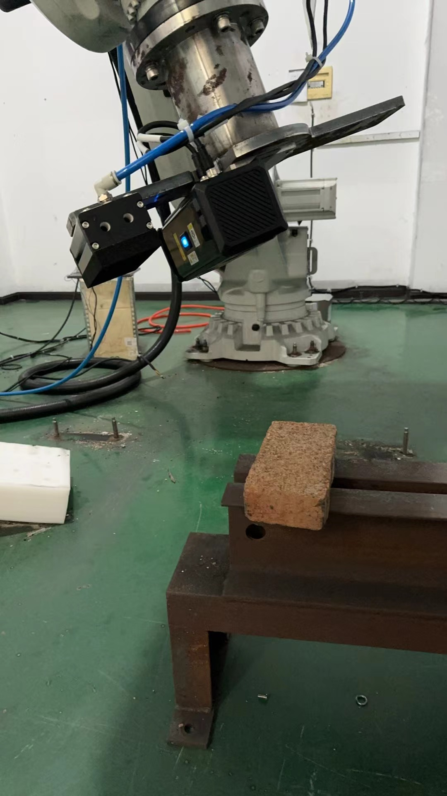
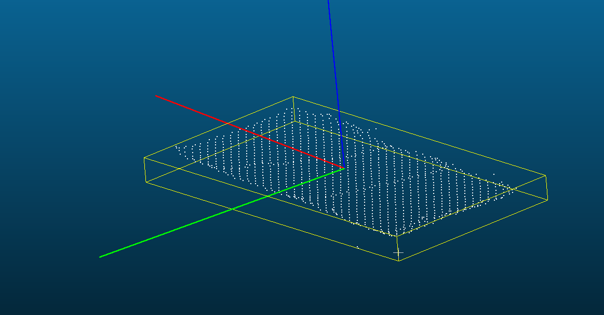

### wall-building

码墙，传送带运输单个砖块，机械臂抓取，并码放。



### 代码流程

加载点云-->(mm2m)-->roi(z,pcl::PassThrough)-->计算中心点（pcl::compute3DCentroid）-->（拟合平面，暂没用到）-->体素滤波（5mm）-->计算三个方向（姿态）（pcl::MomentOfInertiaEstimation计算点云的惯性矩相关特征）（getEigenVectors(major_vector, middle_vector, minor_vector)）-->坐标系转换（tool2cam,tool2base-->cam2base）-->转换到base坐标系（pose：中心点位置+姿态）

### 代码结构 tree

```
├── build
├── CMakeLists.txt
├── data
│   ├── 20240903 143125772_cloud.ply
│   ├── cloud_part.ply
│   ├── res2.ply
│   ├── res.ply
│   └── res_scale.ply
├── images
│   ├── base and cam.png
│   ├── base.png
│   └── 测试场景.jpg
├── README.md
└── src
    ├── main.cpp
    ├── utils.cpp
    └── utils.h
```


### 坐标系变换推导

见./images/坐标系变换推导.png

#### 已知

1. 工具坐标系到相机坐标系的变换矩阵：$$ \mathbf{T}_{CT} $$ 
2. 工具坐标系到基坐标系的变换矩阵：$$ \mathbf{T}_{BT} $$ 

#### 目标

求相机坐标系到基坐标系的变换矩阵 $$ \mathbf{T}_{BC} $$

#### 推导过程

1. 工具坐标系到基坐标系的变换为 $$ \mathbf{T}_{BT} $$，它可以表示为：
   $$
   \mathbf{P}_{B} = \mathbf{T}_{BT} \mathbf{P}_{T}
   $$
   其中，$$ \mathbf{P}_{B} $$ 是点在基坐标系中的表示，$$ \mathbf{P}_{T} $$ 是点在工具坐标系中的表示。

2. 工具坐标系到相机坐标系的变换为 $$ \mathbf{T}_{CT} $$，它可以表示为：
   $$
   \mathbf{P}_{C} = \mathbf{T}_{CT} \mathbf{P}_{T}
   $$
   其中，$$ \mathbf{P}_{C} $$ 是点在相机坐标系中的表示。

为了将相机坐标系下的点转换到基坐标系，我们可以通过将工具坐标系作为中间步骤进行转换。根据矩阵的连乘关系，可以得到相机到基坐标系的变换矩阵 $$ \mathbf{T}_{BC} $$ 为：
$$
\mathbf{T}_{BC} = \mathbf{T}_{BT} \mathbf{T}_{CT}^{-1}
$$

### 运行

```
mkdir build
cd build
cmake ..
make 

./main ../data/res2.ply

```

```
#关键运算结果
相机坐标系下，中心点坐标：
Centroid of point cloud: (-107.736, -44.5767, 691.211)
转换到基坐标系下：
center point  in base : 2224.41 666.126 434.605
 orientation in base (quaternion x y z w):   0.998898  0.0466622 0.00288555 0.00425562
```

### 可视化结果




### 对比计算结果差异

```
## 对比四元数（欧拉角）
quat1 = np.array([0.998892, 0.046662, 0.00288553, 0.00425559])  # (x, y, z, w)
quat2 = np.array([0.004449, 0.999012, 0.044132, 0.002719])     # (w, x, y, z)
## 比较平移
translation1 = np.array([2224.41, 666.126, 434.621])
translation2 = np.array([2224.412598, 666.126038, 434.599182])


旋转差 (X, Y, Z)（度）: [0.29038742 0.01677747 0.02217667]
平移差距 (X, Y, Z)（mm）: ['0.002598', '0.000038', '-0.021818']
```

